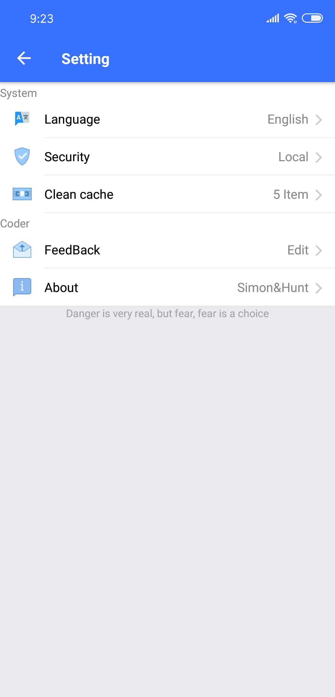

### iPwd

It provide a simple and security way to manage your password

You can download it [here ,this is android apk link](https://expo.io/artifacts/9cd4c713-d9dc-4f92-b426-2d56c5805c1f)

> code format plugin on vscode is 'Prettier'

It looks like this:

and setting screen:

